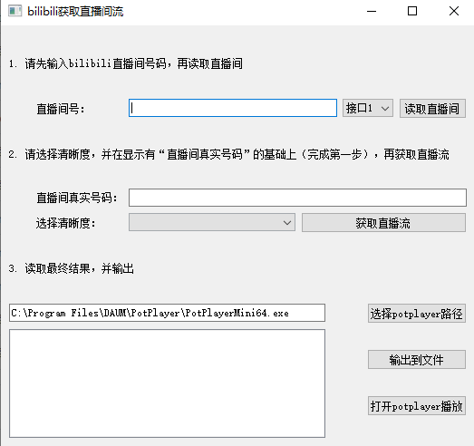

# bilibili-live-stream
## 一个简单地获取bilibili直播流的小工具
### 1. 如何使用
1. 前往 [releases](https://github.com/hLdont/bilibili-live-stream-forWin/releases) 查看并下载最新版本
2. 双击运行mian.exe
3. 按1 2 3 顺序使用即可

> 写在最后：自己写发现挺多bug的，获取直播间状态这个有bug，还没改，而且很多流也有问题。后来才发现了另外的一个获取直播流的脚本库，那个写的挺详细而且挺狠，但是写都写了懒得改了，就这样吧
>
> pyqt写的，不会qml所以非常朴素，以后有机会再用electron、[go-wingui](https://github.com/snail007/go-wingui/releases/tag/v2.0)什么的写写
>
> golang用得也不怎么好，就猛堆屎山，以后再整高质量代码吧
>
> 简简单单用cmd调脚本跨语言而已，没用go-python、高性能RPC、protobuf 之类的仙术，所以还是得把go编译出来的exe文件放到py编译出来的exe文件下，就很屎山

